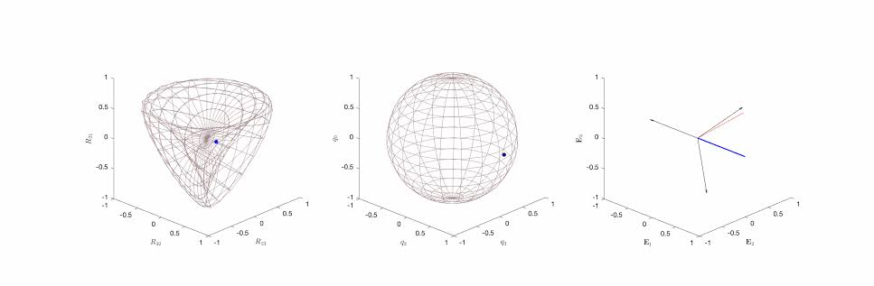

## Rotations, Turns, and Arc Steps

The core purpose of this section is to redefine spatial rotation not just as an abstract physical movement, but as a rigid mathematical operator that can be added, multiplied, and inverted.

Hathaway introduces the concept of a turn—represented visually as a directed great circle arc on a unit sphere (an arc step). Every turn possesses a specific magnitude (the angle of rotation) and a specific direction (the plane of rotation, dictated by its axis).

By establishing a geometry of these spherical arcs, Hathaway develops a method for compounding rotations (multiplying them). He proves that executing two rotations in sequence is equivalent to geometric addition of these arc steps on a sphere, laying the foundation for why quaternion multiplication is non-commutative ($ AB \neq BA$).

#### Rotations and Planes of Rotation

* **The Definition of Rotation:** A transformation of space that keeps one point (the center) fixed while shifting all other points along circular paths around a central axis.
* **The Axis and Angle:** Every rotation is completely defined by its axis (a directed line through the center) and its angular magnitude (measured in radians or degrees).
* **Direction of Rotation:** Hathaway establishes the standard convention for positive vs. negative rotation (right-hand rule / counter-clockwise when looking down the positive axis).

#### Turns and Arc Steps (Spherical Representation)
* **The Unit Sphere Construction:** To analyze pure rotations, Hathaway constructs a sphere of radius 1 centered at the fixed point of rotation.
* **Arc Steps / Directed Arcs:** A rotation can be uniquely represented on this unit sphere as a directed arc of a great circle. This arc is called an **arc step**.
    * The length of the arc corresponds to the angle of the rotation.
    * The plane of the great circle corresponds to the plane of rotation (perpendicular to the axis).
* **Definition of a "Turn":** A turn is an operator that alters the direction of a line or step. Two arc steps are equal if they belong to the same great circle, have the same length, and point in the same direction. Like linear steps, a turn can be shifted around its great circle without changing its mathematical identity.

#### Composition of Turns (Multiplication of Rotations)
* **Successive Executions:** If turn $A$ rotates space, and turn $B$ rotates it next, the combination is the compounded turn $BA$ (read right-to-left as "turn $A$ followed by turn $B$").
* **The Spherical Triangle Construction:** To multiply two turns, Hathaway uses a classic geometric construction:
    1. Let the first turn be represented by the great circle arc $\mathbf{PQ}$.
    2. Let the second turn begin exactly where the first one ends, represented by the arc $\mathbf{QR}$.
    3. The total resulting rotation from the sequence is represented by the third side of the spherical triangle, the arc $\mathbf{PR}$.
    4. Therefore: $\mathbf{QR} \times \mathbf{PQ} = \mathbf{PR}$.
    
* **Non-Commutativity Proved Geometrically:** By showing how changing the order of the arcs ($\mathbf{PQ}$ followed by $\mathbf{QR}$ vs. $\mathbf{QR}$ followed by $\mathbf{PQ}$) leads to entirely different resulting destination points on the sphere, Hathaway visually proves that spatial rotations do not commute.

####  Properties of Turns
* **The Identity Turn:** A turn of $0^\circ$ (or an arc of length zero), which leaves all positions unchanged.
* **Inverse Turns:** The reciprocal or inverse of a turn is the same arc traversed in the opposite direction. A turn multiplied by its inverse results in the identity turn ($A^{-1}A = 1$).
* **Conjugate Rotations:** Hathaway introduces how a rotation behaves when it is itself rotated by another turn, paving the way for the quaternion sandwich operator ($q v q^{-1}$) used in modern computing to rotate vectors.

####  Connection to Spherical Trigonometry

* **Laws of Composition:** The chapter concludes by mapping these geometric arc additions directly to the formulas of spherical trigonometry (such as the spherical law of cosines), demonstrating how the angles and sides of the spherical triangle dictate the exact axis and angle of the combined resultant rotation.