a directed length, what we'd now call a vector. A "variable step" is simply a step whose length and direction both depend on a scalar parameter — Hathaway's example is the literal parameter of time, t.

The worked example is OP = t·OA + ½t²·OB, where OA and OB are two fixed steps from a point O, and t is allowed to range over the real numbers. Plugging in t = −2, −1, 0, 1, 2 gives five points, which Hathaway calls D′, C′, O, C, D, and as t sweeps continuously the point P traces out a smooth curve through them — a parabola. (Hathaway points out this is exactly the path of a projectile: OA is its initial-velocity step, and ½t²·OB is the displacement caused by a constant "downward" acceleration represented by OB.)

