* **Definition of rotation:** A rotation fixes exactly one point (the center) and sweeps every other point along a circular arc around a central axis. The axis itself is unmoved; everything else orbits it. Hathaway is careful to frame this as a transformation of space, not just a movement of objects — the whole coordinate world rotates.
* **The axis–angle pair:** Two pieces of data, and only two, determine a rotation completely: a directed line through the center (the axis), and a scalar (the angle θ, in radians or degrees). This is the payoff of the definition — no matter how complicated the motion looks, you can always reduce it to one arrow and one number. This is precisely why quaternions become so elegant for encoding rotations: a unit quaternion encodes both pieces in a single algebraic object.
* **Sign convention (right-hand rule):**  Point your right thumb along the positive axis direction. Your fingers curl in the direction of positive rotation. Equivalently, looking down the positive axis toward the origin, positive rotation goes counter-clockwise. This is the standard orientation for 3D mathematics and physics, and Hathaway adopts it as the baseline convention before building the quaternion machinery on top.

