a pure rotation has a fixed point — the center O. Every other point of the rotating body moves on a circle around some axis through O. To study what happens to radii under rotation, the key observation is that any axis around which a radius OB rotates into OB′ must be equally inclined to both radii; that is, it must be a diameter of the great circle that bisects the arc BB′ at right angles. Intersecting the sphere with radius 1 around O reduces everything to geometry on that sphere's surface, stripping away length and keeping only direction.

Definitions: Rotation, Turn, and Arc Step
Hathaway gives three interrelated definitions:
A rotation is a rigid motion of a body about a fixed axis through O through some angle. On the unit sphere this corresponds to every surface point sliding along a small circle perpendicular to the axis.
A turn is the operator that carries one direction into another. A versor or unit quaternion is a quaternion that turns only. The turn is represented by the arc of a great circle: the arc from the radius OA to the radius OB, measured on the unit sphere. The great circle containing A and B is the "plane" of the turn. Uwaterloo
An arc step is the directed arc on the unit sphere that represents a turn — it carries both the axis information (which great circle) and the magnitude (how long the arc is, i.e., the angle of rotation).