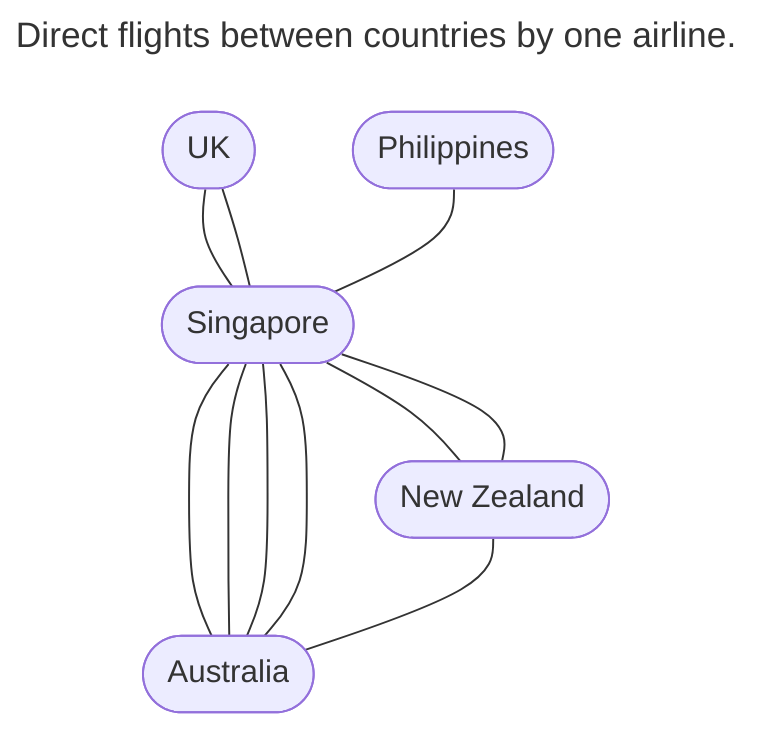

```mermaid
---
title: Direct flights between countries by one airline.
---
flowchart TB
    UK([UK])
    Philippines([Philippines])
    Singapore([Singapore])
    Australia([Australia])
    NewZealand([New Zealand])
    UK --- Singapore
    UK --- Singapore
    Philippines --- Singapore
    Singapore --- Australia
    Singapore --- Australia
    Singapore --- Australia
    Singapore --- Australia
    Singapore --- NewZealand
    Singapore --- NewZealand
    NewZealand --- Australia
```

1.1 Matrices
represent the number of direct flights between each pair of countries