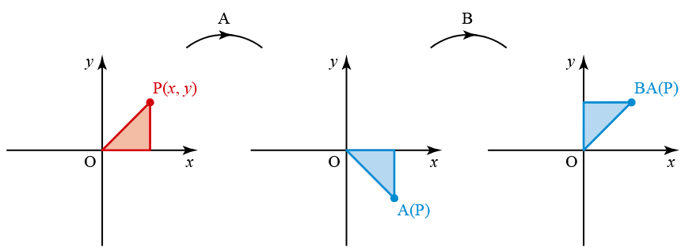

explores how two or more linear transformations (represented by matrices) can be applied one after the other, and how to find the single matrix that represents the combined (successive) transformation.

When two transformations are applied in sequence, the overall effect is found by multiplying their matrices in the reverse order of application.

Important Rule:
- If transformation A is followed by transformation B,
the combined transformation is:
\[
    B \times A
\]
(Matrix B is applied after matrix A, so B comes first in the multiplication.)

- $\begin{bmatrix}
x\\
y
\end{bmatrix}$  → $\begin{bmatrix}
x\\
-y
\end{bmatrix} $ → $\begin{bmatrix}
y\\
x
\end{bmatrix} $

- Reflection in the y=x $\begin{bmatrix}
0&1\\
1&0
\end{bmatrix}$

---

\[
\begin{bmatrix}
0 & 1\\
1 & 0 
\end{bmatrix}\begin{bmatrix}
x\\
y
\end{bmatrix}=\begin{bmatrix}
y\\
x
\end{bmatrix}
\]

---

- $\begin{bmatrix}
x\\
y
\end{bmatrix}$  → $\begin{bmatrix}
x\\
-y
\end{bmatrix} $

- Reflection in the x-axis A= $\begin{bmatrix}
1&0\\
0&-1
\end{bmatrix}$

---

\[
\begin{bmatrix}
1 & 0\\
0 & -1
\end{bmatrix}\begin{bmatrix}
x\\
y
\end{bmatrix}=\begin{bmatrix}
x\\
-y
\end{bmatrix}
\]

---

- $\begin{bmatrix}
x\\
-y
\end{bmatrix}$  → $\begin{bmatrix}
y\\
x
\end{bmatrix} $
- Rotation anticlockwise about the origin through angle θ B= $\begin{bmatrix}
cosθ&-sinθ\\
sinθ&cosθ
\end{bmatrix}$

---

\[
\begin{bmatrix}
cos90^{\circ}&-sin90^{\circ}\\
sin90^{\circ}&cos90^{\circ}
\end{bmatrix}\begin{bmatrix}
x\\
-y
\end{bmatrix}=\begin{bmatrix}
0&-1\\
1&0
\end{bmatrix}\begin{bmatrix}
x\\
-y
\end{bmatrix}=\begin{bmatrix}
y\\
x
\end{bmatrix}
\]

---
\[
    A= \begin{bmatrix}
1&0\\
0&-1
\end{bmatrix}\\
 B= \begin{bmatrix}
cosθ&-sinθ\\
sinθ&cosθ
\end{bmatrix} = \begin{bmatrix}
cos90^{\circ}&-sin90^{\circ}\\
sin90^{\circ}&cos90^{\circ}
\end{bmatrix} =\begin{bmatrix}
0&-1\\
1&0
\end{bmatrix}\\
    B\times A\\
\begin{bmatrix}
0&-1\\
1&0
\end{bmatrix}\begin{bmatrix}
1 & 0\\
0 & -1
\end{bmatrix}=\begin{bmatrix}
0 & 1\\
1 & 0 
\end{bmatrix}
\]

- Reflection in the y=x $\begin{bmatrix}
0&1\\
1&0
\end{bmatrix}$