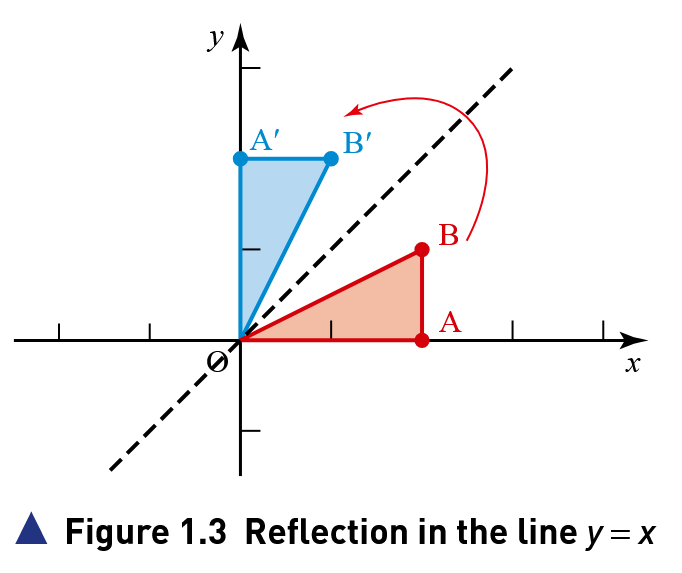
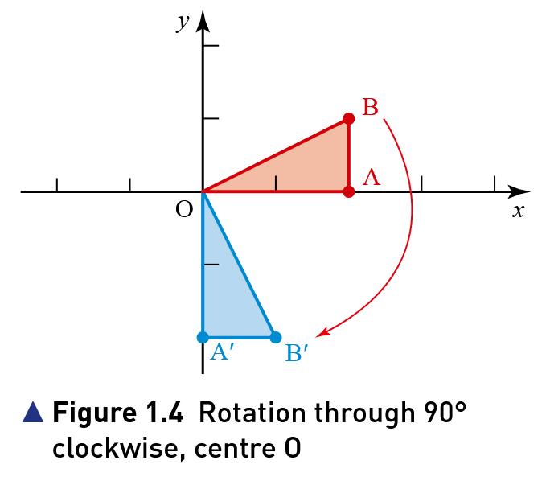
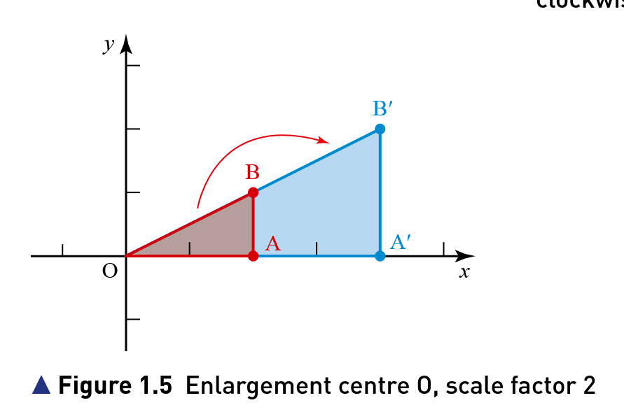
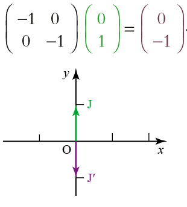
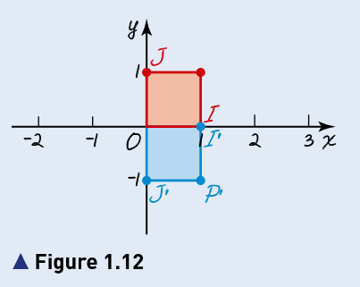
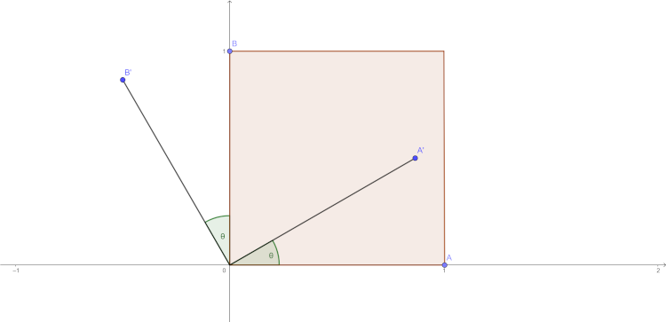

# Reflections

# Rotations 

# Enlargement 

- Object
  - The original point, or shape, is called the object.
- Image
  - The new point, or shape, after the transformation, is called the image.
- Mapping
  - A transformation is a mapping of an object onto its image.

## Rotations

 the matrix $\begin{bmatrix}
 -1 & 0 \\
 0  & -1 \\
 \end{bmatrix}$ represents a rotation, centre the origin, through 180°.

$\begin{bmatrix}
 -1 & 0 \\
 0  & -1 \\
\end{bmatrix}\begin{bmatrix}
2 \\
5 
\end{bmatrix} = \begin{bmatrix}
-2 \\
-5
\end{bmatrix}$

## Reflections $(y=x)$
$\begin{bmatrix}
 0 & 1 \\
 1  & 0 \\
\end{bmatrix}\begin{bmatrix}
2 \\
5 
\end{bmatrix} = \begin{bmatrix}
5 \\
2
\end{bmatrix}$

$\begin{bmatrix}
 0 & 1 \\
 1  & 0 \\
\end{bmatrix}\begin{bmatrix}
-3 \\
8
\end{bmatrix} = \begin{bmatrix}
8 \\
-3
\end{bmatrix}$

## Enlargement
$\begin{bmatrix}
 2 & 0 \\
 0  & 2 \\
\end{bmatrix}\begin{bmatrix}
2 \\
5 
\end{bmatrix} = \begin{bmatrix}
4 \\
10
\end{bmatrix}$

$\begin{bmatrix}
 2 & 0 \\
 0  & 2 \\
\end{bmatrix}\begin{bmatrix}
-3 \\
8
\end{bmatrix} = \begin{bmatrix}
-6 \\
16
\end{bmatrix}$

---

The unit square in a 2D coordinate system typically has vertices as (0,0),(1,0),(1,1) and (1,0). A reflection in the x-axis flips points across the x-axis,keeping the x-coordiante unchanged and negating the y-coordinate.Let's map the vertices of the unit square under this transformation:
- (0,0) → (0,0) (remains unchanged as it's on the x-axis).
- (1,0) → (1,0) (remains unchanged as it's on the x-axis).
- (0,1) → (0,-1) (y-coordinate changes from 1 to -1).
- (1,1) → (1,-1) (y-coordinate changes from 1 to -1).

If we were to draw the unit square and its image:
- The original unit square has vertices connected to form a square in the first quadrant.
- The image after reflection forms a square with vertices (0,0),(1,0),(1,-1),(0,-1).lying in the fourth quadrant (except for the x-axis points).

To find the transformation matrix,consider a general point (x,y) transformed to (x,-y). The transformation can be represented by a 2x2 matrix(A) such that:
\[
\begin{bmatrix}
x'\\
y'
\end{bmatrix}=A\begin{bmatrix}
x\\
y
\end{bmatrix}=\begin{bmatrix}
x\\
-y
\end{bmatrix}
\]

we need a matrix $ A=\begin{bmatrix}
a & b\\
c & d
\end{bmatrix} $ such that:

\[
\begin{bmatrix}
a & b\\
c & d
\end{bmatrix}\begin{bmatrix}
x\\
y
\end{bmatrix}=\begin{bmatrix}
x\\
-y
\end{bmatrix}
\]

This gives:
- $ax + by = x$
- $cx + dy = -y$

For these equations to hold for all $(x,y)$:
- From $ax+by=x$ : $a=1,b=0$(coefficients of (x)  and (y)).
- From $cx+dy=-y$: $c=0,d=-1$.

Thus, the matrix is:
\[
\begin{bmatrix}
1 & 0\\
0 & -1
\end{bmatrix}
\]

---

- A(1,0) → A'(cosθ ,sinθ)
- B(0,1) → B'(-sinθ ,cosθ)

\[
\begin{bmatrix}
a & b\\
c & d
\end{bmatrix}\begin{bmatrix}
1\\
0
\end{bmatrix}=\begin{bmatrix}
cosθ\\
sinθ
\end{bmatrix}
\]

- $ a+0=cosθ$ : $a=cosθ$
- $ c+0 = sinθ $ : $ c=sinθ $

\[
\begin{bmatrix}
a & b\\
c & d
\end{bmatrix}\begin{bmatrix}
0\\
1
\end{bmatrix}=\begin{bmatrix}
-sinθ\\
cosθ
\end{bmatrix}
\]

- $ 0+b=-sinθ$ : $b=-sinθ$
- $ 0+d = cosθ $ : $ d=cosθ $

Thus, the matrix is:
\[
\begin{bmatrix}
cosθ & -sinθ\\
sinθ & cosθ
\end{bmatrix}
\]

---

- The matrix $\begin{bmatrix}
m & 0\\
0 & 1
\end{bmatrix}$ represents a stretch of scale factor m parallel to the
$x-axis$.

- The matrix $\begin{bmatrix}
1 & 0\\
0 & n
\end{bmatrix}$ represents a stretch of scale factor m parallel to the
$y-axis$.