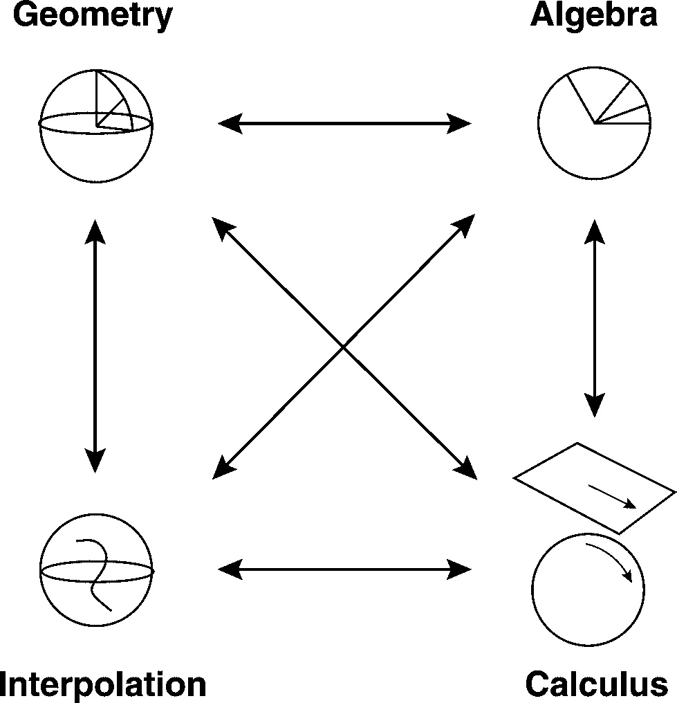

- **The Complex Number Connection** draws the analogy between quaternions and complex numbers. Just as complex numbers can be understood both algebraically (a + bi) and geometrically (as points/rotations in the plane), Hanson previews that quaternions will get the same dual treatment — algebraic definition alongside a geometric picture (points on/around a 4D hypersphere, related to 3D rotations). This mirrors the pedagogical arc of the book: complex numbers are the "training wheels" for understanding what a quaternion's geometric meaning is.

- **The Cornerstones of Quaternion Visualization** lays out the small set of core visual/conceptual tools the rest of the book will repeatedly lean on to make quaternions tangible — things like relating quaternion multiplication to rotations, the double-cover relationship between unit quaternions and 3D rotations (a quaternion and its negative represent the same rotation), and the general strategy of using spheres and rolling/sliding geometric metaphors to make 4D objects graspable.

