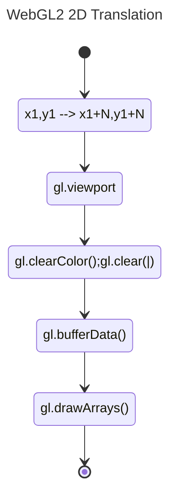

# First thing

```mermaid
---
title: WebGL2 2D Translation
---
stateDiagram-v2
    state "x1,y1 --> x1+N,y1+N" as update
    state "gl.viewport" as viewport
    state "gl.clearColor();gl.clear(|)" as clear
    state "gl.bufferData()" as bufferData
    state "gl.drawArrays()" as drawArrays
    [*] --> update
    update --> viewport
    viewport --> clear
    clear --> bufferData 
    bufferData --> drawArrays
    drawArrays --> [*]
```