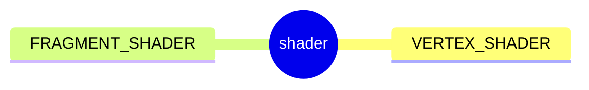
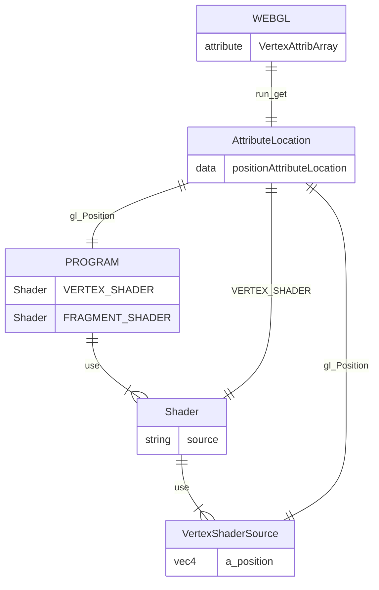

#  4 ways a shader can receive data.
- Attributes, Buffers, and Vertex Arrays
- Uniforms
- Textures
- Varyings



###### createShader
```js
gl.createShader(...)
gl.shaderSource(...)
gl.compileShader(...)
gl.getShaderParameter(...)
gl.deleteShader(...)
```

###### createProgram
```js
gl.createProgram(...)
gl.attachShader(program,vertexShader)
gl.attachShader(program,fragmentShader)
gl.linkProgram(...)
gl.getProgramParameter(...)
```

look up where the vertex data needs to go.

