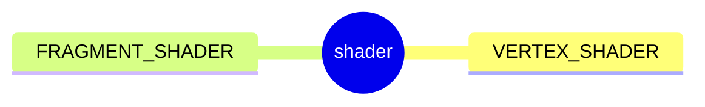
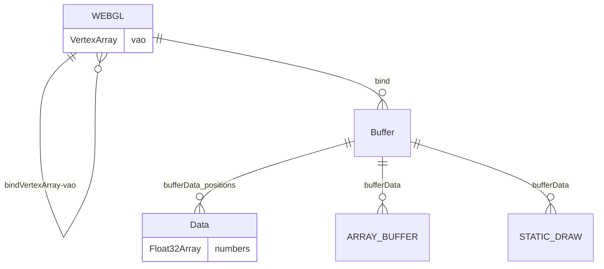
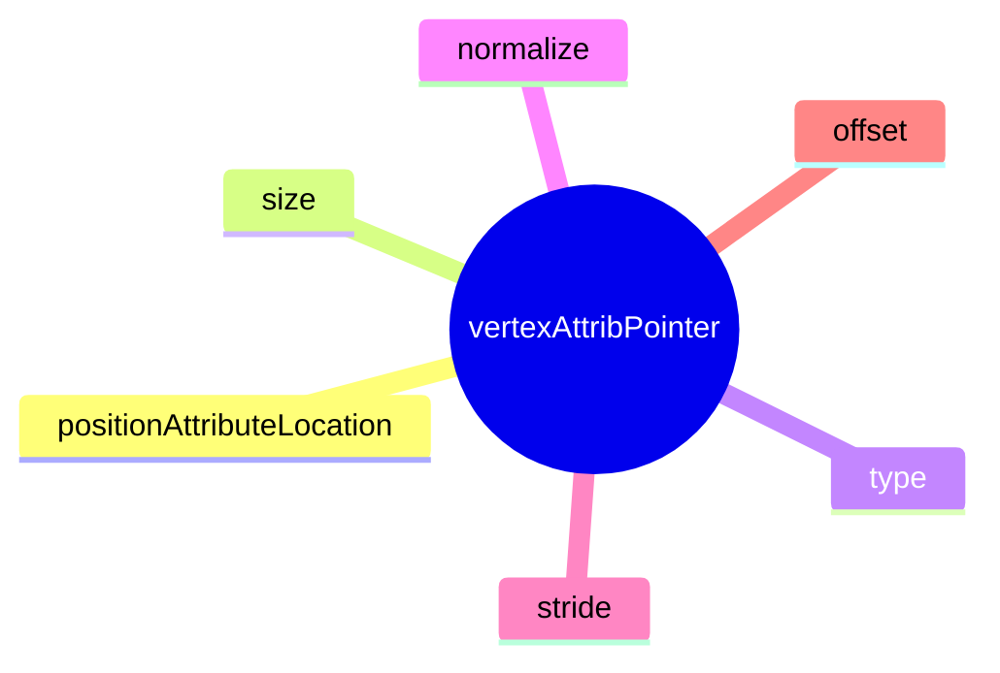
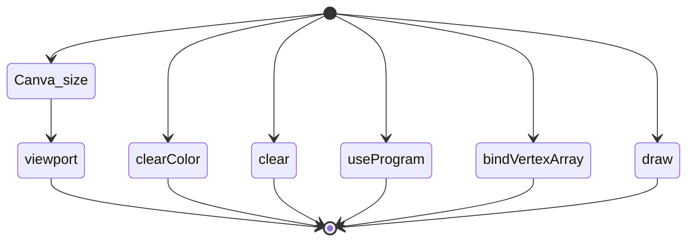
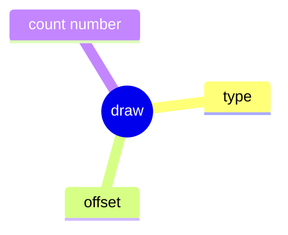

#  4 ways a shader can receive data.
- Attributes, Buffers, and Vertex Arrays
- Uniforms
- Textures
- Varyings



###### createShader
```js
gl.createShader(...)
gl.shaderSource(...)
gl.compileShader(...)
gl.getShaderParameter(...)
gl.deleteShader(...)
```

###### createProgram
```js
gl.createProgram(...)
gl.attachShader(program,vertexShader)
gl.attachShader(program,fragmentShader)
gl.linkProgram(...)
gl.getProgramParameter(...)
```

-  look up where the vertex data needs to go.[**AttributeLocation**]


- **ARRAY_BUFFER** [Create a buffer and put three 2d clip space points in it]
- **VertexArray** [Create a vertex array object (attribute state)]


- Tell the attribute how to get data out of positionBuffer (ARRAY_BUFFER)
  - **size** - size of components per iteration
  - **type** - the data is 32bit floats
  - **normalize** -don't normalize the data
  - **stride** 0 = move forward size * sizeof(type) each iteration to get the next position
  - **offset** start at the beginning of the buffer



---

- draw
  - type = gl.TRIANGLES
  - offset 0
  - count number



---