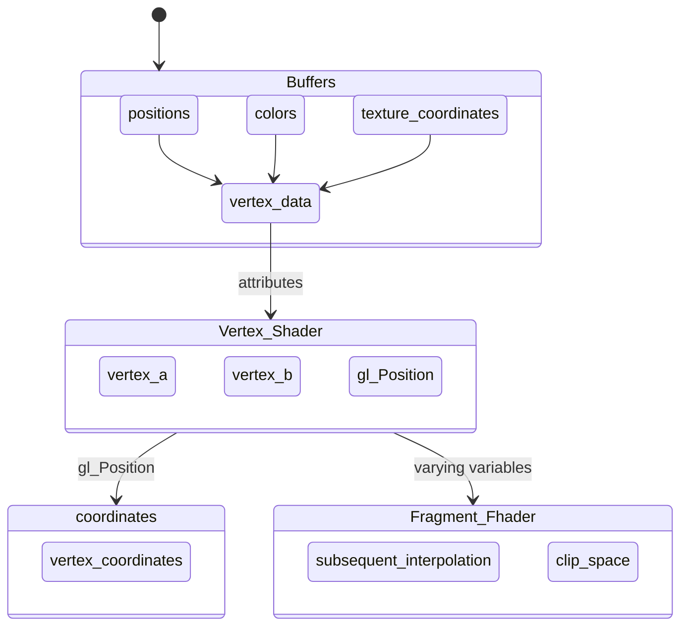
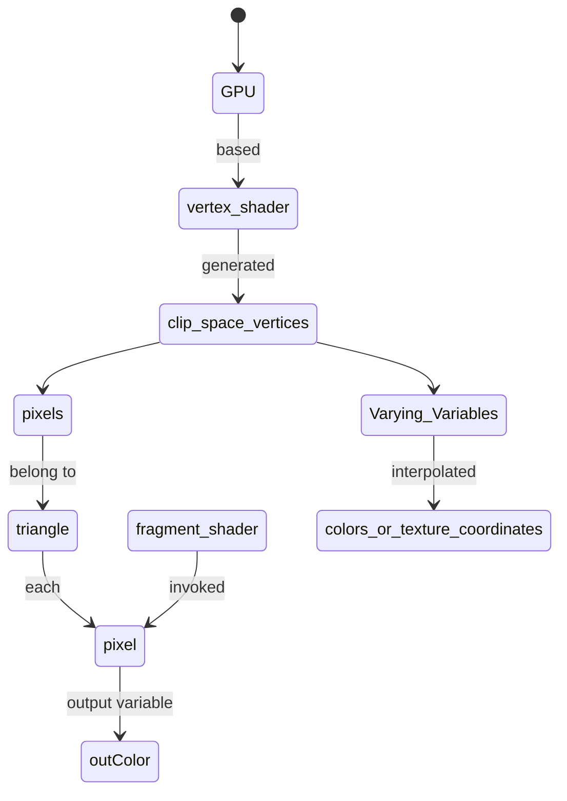
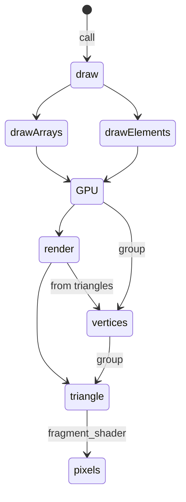

# How WebGL2 Works

- **two main tasks of the GPU:**
    - **Vertex Processing**
    - **Pixel Rendering (Fragment Processing)**

## Vertex Processing

```mermaid
stateDiagram-v2
    [*] --> Buffers
    state Buffers {
       positions --> vertex_data
       colors --> vertex_data
        texture_coordinates --> vertex_data
    }

    state Vertex_Shader {
      vertex_a
      vertex_b
      gl_Position 
    }
    state coordinates {
         vertex_coordinates 
    }
    vertex_data --> Vertex_Shader :attributes
    Vertex_Shader --> coordinates :gl_Position 
    state Fragment_Fhader {
         subsequent_interpolation
         clip_space 


    }
    Vertex_Shader --> Fragment_Fhader :varying variables

 

```

```mermaid
stateDiagram-v2
    [*] --> GPU
    GPU --> vertex_shader : based
    vertex_shader -->  clip_space_vertices : generated 
    clip_space_vertices --> pixels
    pixels --> triangle : belong to
    triangle --> pixel : each
    fragment_shader --> pixel : invoked 
    pixel --> outColor :  output variable
    clip_space_vertices --> Varying_Variables
    Varying_Variables --> colors_or_texture_coordinates : interpolated 


```

```mermaid
stateDiagram-v2
    [*] --> draw : call
    draw --> drawArrays 
    draw --> drawElements
    drawArrays --> GPU
    drawElements --> GPU
    render --> vertices : from triangles

    GPU --> render
    GPU --> vertices : group
    render --> triangle
    vertices --> triangle: group
    triangle --> pixels : fragment_shader
```