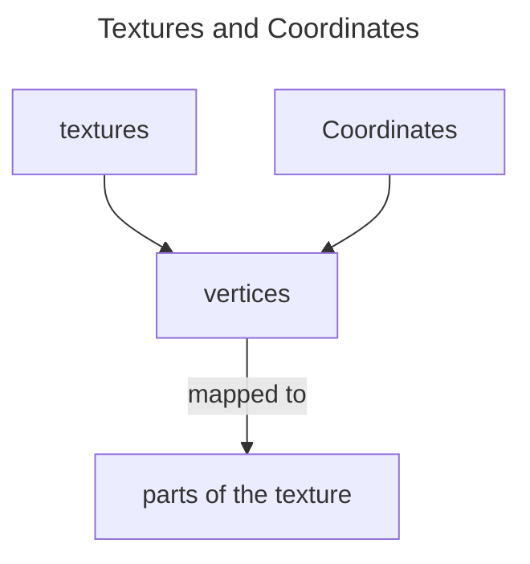
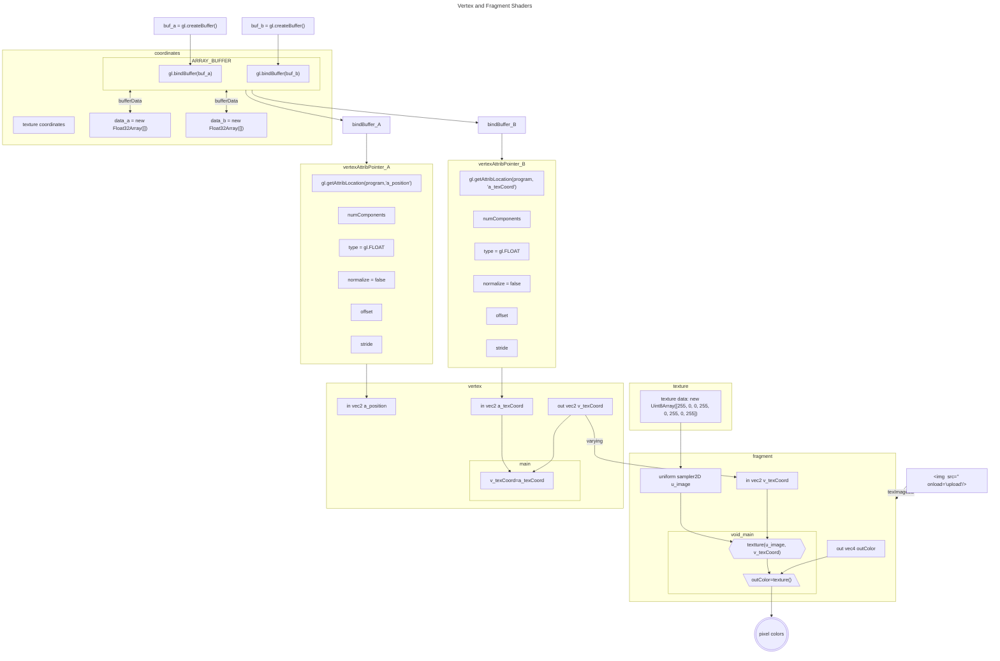

# WebGL2 Image Processing

### Key Concepts of WebGL2 Image Processing






# Texture Units 

Texture units are hardware slots 

```js
var textureUnitIndex = 6;
var u_imageLoc = gl.getUniformLocation(program, "u_image");
gl.uniform1i(u_imageLoc, textureUnitIndex); // Link u_image to texture unit 6
gl.activeTexture(gl.TEXTURE0 + textureUnitIndex); // Activate unit 6
gl.bindTexture(gl.TEXTURE_2D, someTexture); // Bind texture to unit 6
```