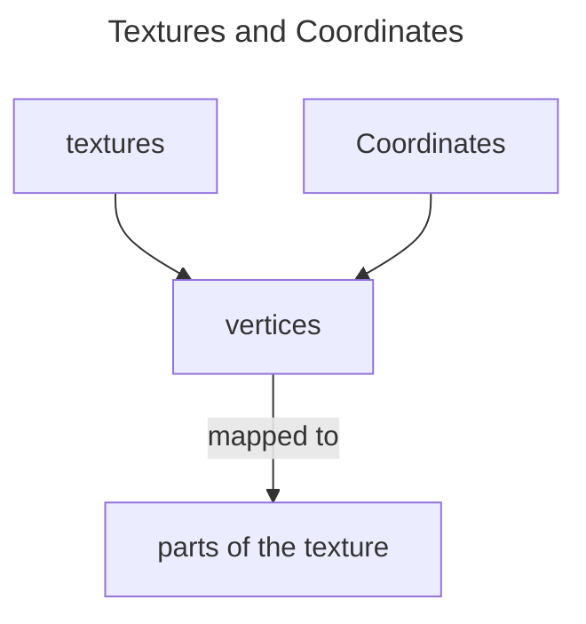
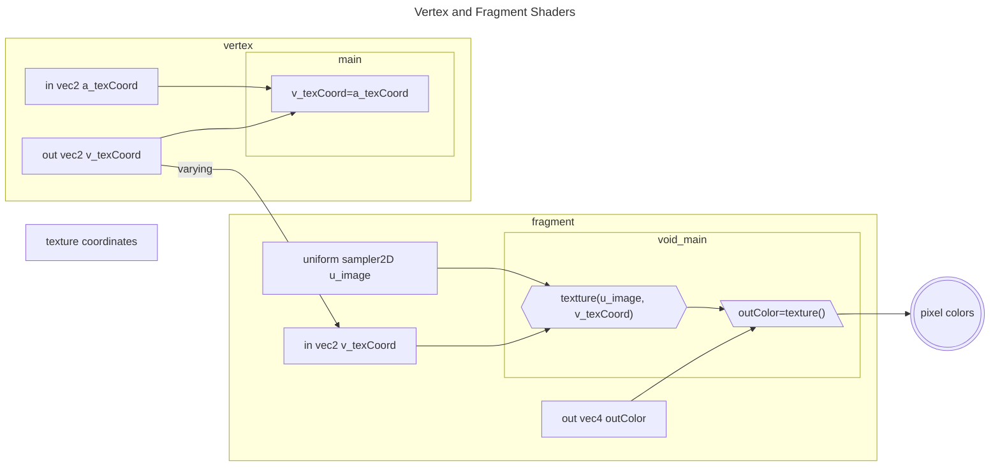

# WebGL2 Image Processing

### Key Concepts of WebGL2 Image Processing

```mermaid
---
title: Textures and Coordinates
---
flowchart 
    textures 
    Coordinates
    part[parts of the texture]
    textures --> vertices 
    Coordinates --> vertices
    vertices -- mapped to  --> part
```

```mermaid
---
title: Vertex and Fragment Shaders
---
flowchart LR
    coord[texture coordinates]
    subgraph fragment
        in_v_text[in vec2 v_texCoord]
        out[out vec4 outColor]
        uniform[uniform sampler2D u_image]
        
        subgraph void_main
            texture@{ shape: hex, label: "textture(u_image, v_texCoord)" }
            output@{ shape: lean-l, label: "outColor=texture()" }
        end
        uniform --> texture
        in_v_text --> texture
        texture --> output
        out --> output
    end

    subgraph vertex 
        a_text_Coord[in vec2 a_texCoord]
        out_v_text[out vec2 v_texCoord]
        
        subgraph main
            set[v_texCoord=a_texCoord]
        end
        a_text_Coord --> set
        out_v_text --> set
    end
    colors@{ shape: dbl-circ, label: "pixel colors" }
    out_v_text -- varying  --> in_v_text
    output --> colors
```