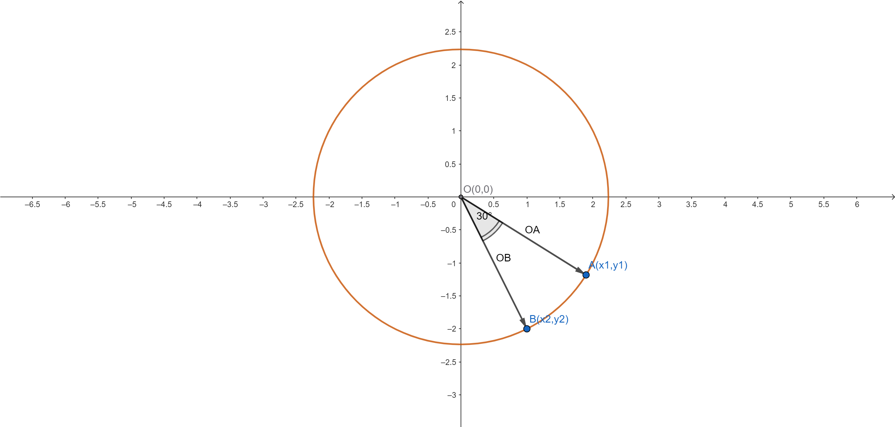

- vertex shader
  - a,b
- rotation values
  - x,y

```math
rotatedPosition  = ( a*y+b*x,b*y-a*x)
```

  

### Problem
In a coordinate system with origin \( O(0,0) \), a circle is drawn with center \( O \) and radius 5. Given a point \( A(x_1, y_1) \) on the circle, and point \( B \) on the circle such that the angle \( \angle AOB = 30^\circ \), find the coordinates of point \( B(x_2, y_2) \) given point \( A(x_1, y_1) \).

---

### Solution

#### Given Conditions
1. The equation of the circle with center at the origin \( O(0,0) \) and radius 5 is:
   \[
   x^2 + y^2 = 25
   \]
2. Point \( A(x_1, y_1) \) lies on the circle, so:
   \[
   x_1^2 + y_1^2 = 25
   \]
3. Point \( B(x_2, y_2) \) also lies on the circle, so:
   \[
   x_2^2 + y_2^2 = 25
   \]
4. The angle between vectors \( \overrightarrow{OA} \) and \( \overrightarrow{OB} \) is \( \angle AOB = 30^\circ = \frac{\pi}{6} \) radians.

#### Derivation
Since points \( A \) and \( B \) are on the circle, we can represent them in polar coordinates:
- \( A(x_1, y_1) = (5 \cos \theta_1, 5 \sin \theta_1) \), where \( \theta_1 \) is the polar angle of \( \overrightarrow{OA} \).
- \( B(x_2, y_2) = (5 \cos \theta_2, 5 \sin \theta_2) \), where \( \theta_2 \) is the polar angle of \( \overrightarrow{OB} \).

The angle condition \( \angle AOB = 30^\circ \) implies:
\[
|\theta_2 - \theta_1| = \frac{\pi}{6}
\]
Thus, \( \theta_2 \) has two possible values:
\[
\theta_2 = \theta_1 + \frac{\pi}{6} \quad \text{or} \quad \theta_2 = \theta_1 - \frac{\pi}{6}
\]

#### Vector Angle Formula
To verify, we use the vector angle formula. For vectors \( \overrightarrow{OA} = (x_1, y_1) \) and \( \overrightarrow{OB} = (x_2, y_2) \), the angle \( \theta = 30^\circ \) satisfies:
\[
\cos \theta = \frac{\overrightarrow{OA} \cdot \overrightarrow{OB}}{|\overrightarrow{OA}| |\overrightarrow{OB}|}
\]
Since \( |\overrightarrow{OA}| = |\overrightarrow{OB}| = 5 \), the dot product is:
\[
\overrightarrow{OA} \cdot \overrightarrow{OB} = x_1 x_2 + y_1 y_2
\]
\[
\cos 30^\circ = \frac{\sqrt{3}}{2} = \frac{x_1 x_2 + y_1 y_2}{5 \cdot 5}
\]
\[
x_1 x_2 + y_1 y_2 = 25 \cdot \frac{\sqrt{3}}{2} = \frac{25 \sqrt{3}}{2}
\]
Additionally, point \( B(x_2, y_2) \) must satisfy the circle’s equation:
\[
x_2^2 + y_2^2 = 25
\]

#### Polar Coordinate Approach
To simplify, we use polar coordinates. Given \( A(x_1, y_1) = (5 \cos \theta_1, 5 \sin \theta_1) \), we need to find \( B(x_2, y_2) = (5 \cos \theta_2, 5 \sin \theta_2) \). Since \( \theta_2 = \theta_1 \pm \frac{\pi}{6} \), the coordinates of \( B \) are:
\[
B = \left( 5 \cos \left( \theta_1 + \frac{\pi}{6} \right), 5 \sin \left( \theta_1 + \frac{\pi}{6} \right) \right) \quad \text{or} \quad B = \left( 5 \cos \left( \theta_1 - \frac{\pi}{6} \right), 5 \sin \left( \theta_1 - \frac{\pi}{6} \right) \right)
\]

#### Express \( \theta_1 \) in Terms of \( x_1, y_1 \)
The polar angle \( \theta_1 \) for point \( A(x_1, y_1) \) is:
\[
\theta_1 = \arctan \frac{y_1}{x_1}
\]
Adjust \( \theta_1 \) based on the quadrant of \( (x_1, y_1) \):
- If \( x_1 > 0 \), then \( \theta_1 = \arctan \frac{y_1}{x_1} \).
- If \( x_1 < 0, y_1 \geq 0 \), then \( \theta_1 = \arctan \frac{y_1}{x_1} + \pi \).
- If \( x_1 < 0, y_1 < 0 \), then \( \theta_1 = \arctan \frac{y_1}{x_1} - \pi \).
- If \( x_1 = 0, y_1 > 0 \), then \( \theta_1 = \frac{\pi}{2} \).
- If \( x_1 = 0, y_1 < 0 \), then \( \theta_1 = -\frac{\pi}{2} \).

#### Compute Coordinates of \( B \)
Using trigonometric identities:
\[
\cos \left( \theta_1 \pm \frac{\pi}{6} \right) = \cos \theta_1 \cos \frac{\pi}{6} \mp \sin \theta_1 \sin \frac{\pi}{6} = \cos \theta_1 \cdot \frac{\sqrt{3}}{2} \mp \sin \theta_1 \cdot \frac{1}{2}
\]
\[
\sin \left( \theta_1 \pm \frac{\pi}{6} \right) = \sin \theta_1 \cos \frac{\pi}{6} \pm \cos \theta_1 \sin \frac{\pi}{6} = \sin \theta_1 \cdot \frac{\sqrt{3}}{2} \pm \cos \theta_1 \cdot \frac{1}{2}
\]
Since \( \cos \theta_1 = \frac{x_1}{5} \), \( \sin \theta_1 = \frac{y_1}{5} \), we get:
\[
x_2 = 5 \cos \left( \theta_1 \pm \frac{\pi}{6} \right) = 5 \left( \frac{x_1}{5} \cdot \frac{\sqrt{3}}{2} \mp \frac{y_1}{5} \cdot \frac{1}{2} \right) = \frac{\sqrt{3} x_1 \mp y_1}{2}
\]
\[
y_2 = 5 \sin \left( \theta_1 \pm \frac{\pi}{6} \right) = 5 \left( \frac{y_1}{5} \cdot \frac{\sqrt{3}}{2} \pm \frac{x_1}{5} \cdot \frac{1}{2} \right) = \frac{\sqrt{3} y_1 \pm x_1}{2}
\]

### Final Answer
Given point \( A(x_1, y_1) \) (satisfying \( x_1^2 + y_1^2 = 25 \)), the coordinates of point \( B(x_2, y_2) \) are:
1. For \( \theta_2 = \theta_1 + \frac{\pi}{6} \):
   \[
   x_2 = \frac{\sqrt{3} x_1 - y_1}{2}, \quad y_2 = \frac{\sqrt{3} y_1 + x_1}{2}
   \]
2. For \( \theta_2 = \theta_1 - \frac{\pi}{6} \):
   \[
   x_2 = \frac{\sqrt{3} x_1 + y_1}{2}, \quad y_2 = \frac{\sqrt{3} y_1 - x_1}{2}
   \]

\[
\boxed{
\left( \frac{\sqrt{3} x_1 - y_1}{2}, \frac{\sqrt{3} y_1 + x_1}{2} \right) \quad \text{or} \quad \left( \frac{\sqrt{3} x_1 + y_1}{2}, \frac{\sqrt{3} y_1 - x_1}{2} \right)
}
\]