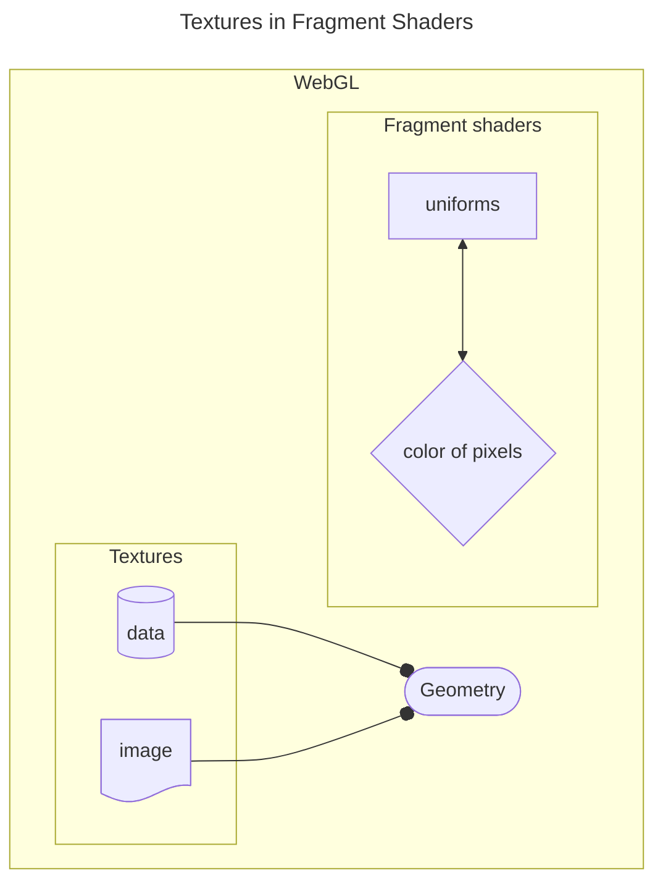
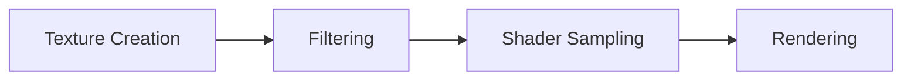
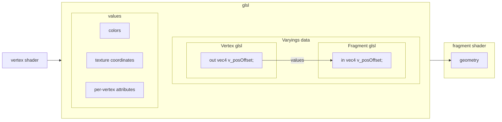
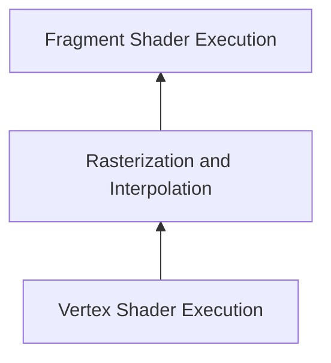

## Textures in Fragment Shaders

Textures in WebGL are used to apply images or data to geometry, often in fragment shaders to determine the color of pixels. In WebGL2, textures are accessed via sampler uniforms in shaders, and the texture GLSL function retrieves values from them. 



### Creating and Configuring a Texture
1. Create a texture object.
2. Bind it to a texture target.
3. Upload data to the texture.
4. Configure texture parameters (e.g., filtering).

```js
//Example: Creating a Texture
var tex = gl.createTexture();
gl.bindTexture(gl.TEXTURE_2D, tex);
var level = 0; // Mipmap level (0 for base level)
var internalFormat = gl.RGBA; // Internal storage format
var width = 2; // Texture width
var height = 1; // Texture height
var border = 0; // Must always be 0 in WebGL2
var format = gl.RGBA; // Format of the provided data
var type = gl.UNSIGNED_BYTE; // Data type of the provided data
var data = new Uint8Array([255, 0, 0, 255, 0, 255, 0, 255]); // Two pixels: red and green
gl.texImage2D(gl.TEXTURE_2D, level, internalFormat, width, height, border, format, type, data);
``` 
###### Texture Data Details

1. The data array (Uint8Array) contains 8 bytes for two RGBA pixels:
    1. Pixel 1: (255, 0, 0, 255) → Red with full opacity.
    2. Pixel 2: (0, 255, 0, 255) → Green with full opacity.
2. The texture is 2 pixels wide and 1 pixel tall, so texcoord.x = 0.5 samples roughly between the two pixels, potentially blending their colors based on filtering settings.


### Using Textures in Fragment Shaders
```glsl
#version 300 es
precision highp float;

uniform sampler2D u_texture;
out vec4 outColor;

void main() {
   vec2 texcoord = vec2(0.5, 0.5); // Sample from the middle of the texture
   outColor = texture(u_texture, texcoord);
}
```

### Setting Texture Parameters (Filtering)
```js
//Example: Setting Filtering
gl.texParameteri(gl.TEXTURE_2D, gl.TEXTURE_MIN_FILTER, gl.LINEAR);
```

### Binding the Texture to a Shader

1. Look up the uniform location.
2. Bind the texture to a texture unit.
3. Tell the shader which texture unit to use.

```js
//Example: Binding and Setting the Uniform
var someSamplerLoc = gl.getUniformLocation(someProgram, "u_texture");
var unit = 5; // Pick texture unit 5
gl.activeTexture(gl.TEXTURE0 + unit); // Activate texture unit 5
gl.bindTexture(gl.TEXTURE_2D, tex); // Bind the texture to unit 5
gl.uniform1i(someSamplerLoc, unit); // Tell the shader to use unit 5
```

### How It All Works Together




### Varyings in WebGL2



