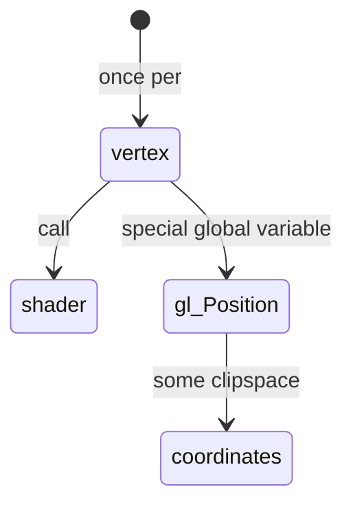

# Vertex Shader

A Vertex Shader’s job is to generate clipspace coordinates. It always takes the form

```glsl
#version 300 es
void main() {
    gl_Position = doMathToMakeClipspaceCoordinates
}
```



1. Vertex shaders 
    1. Data
        1. Attributes
            - data pulled from buffers
            ```glsl
            #version 300 es
                
            //Attributes can use float, vec2, vec3, vec4, mat2, mat3, mat4, int, ivec2, ivec3, ivec4, uint, uvec2, uvec3, uvec4 as types

            //in  float, vec2, vec3, vec4, mat2, mat3, mat4, int, ivec2, ivec3, ivec4, uint, uvec2, uvec3, uvec4 a_position;

            //Attributes
            in vec4 a_position;
                
            void main() {
                gl_Position = a_position;
            }
            ```
        2. Uniforms 
            - values that stay the same for all vertices of a single draw call
            ```glsl
            #version 300 es

            in vec4 a_position;

            //uniform  various types (e.g., float, vec2, vec4, mat4, etc.)

            //Uniforms 
            uniform vec4 u_offset;

            void main() {
            gl_Position = a_position + u_offset;
            }
            ```

            ```mermaid
            stateDiagram
                Attributes --> a_position : in
                Uniforms  --> u_offset : uniform 
                a_position --> gl_Position  : main
                u_offset --> gl_Position : main
            ```

            ```js
            // Get the uniform location
            var offsetLoc = gl.getUniformLocation(someProgram, "u_offset");

            // Set the uniform value before drawing
            gl.uniform4fv(offsetLoc, [1, 0, 0, 0]); // Offset to the right half of the screen
            ```

            ```mermaid
            mindmap
            root((WebGL functions))
                Floats
                    gl.uniform1f
                    gl.uniform1fv
                Vectors-float
                    gl.uniform2f
                    gl.uniform2fv
                    gl.uniform3f
                    gl.uniform3fv
                Matrices
                    gl.uniformMatrix2fv
                    gl.uniformMatrix3fv
                    gl.uniformMatrix4fv
                Integers
                    gl.uniform1i
                    gl.uniform1iv
                    gl.uniform2i
                    gl.uniform2iv
                Unsigned Integers
                    gl.uniform1u
                    gl.uniform1uv
                    gl.uniform2u
                    gl.uniform2uv
                Samplers -for textures
                    gl.uniform1i
                    gl.uniform1iv
                Booleans
                    gl.uniform1i
                        0-false
                        non-zero-true
                    gl.uniform1iv        
            ```

            ##### Notes on Structs
            ```glsl
            struct SomeStruct {
            bool active;
            vec2 someVec2;
            };
            uniform SomeStruct u_someThing;
            ```
            ```js
            var someThingActiveLoc = gl.getUniformLocation(someProgram, "u_someThing.active");
            var someThingSomeVec2Loc = gl.getUniformLocation(someProgram, "u_someThing.someVec2");
            gl.uniform1i(someThingActiveLoc, 1); // Set active to true
            gl.uniform2fv(someThingSomeVec2Loc, [1, 2]); // Set someVec2
            ```

        3. Textures 
            - data from pixels/texels