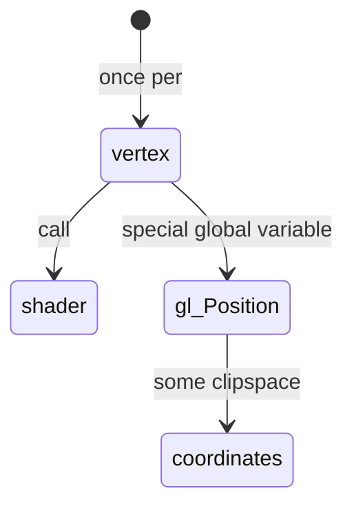

# Vertex Shader

A Vertex Shader’s job is to generate clipspace coordinates. It always takes the form

```glsl
#version 300 es
void main() {
    gl_Position = doMathToMakeClipspaceCoordinates
}
```



- Vertex shaders 
    - Data
        - Attributes
            - data pulled from buffers
```glsl
#version 300 es
    
//Attributes can use float, vec2, vec3, vec4, mat2, mat3, mat4, int, ivec2, ivec3, ivec4, uint, uvec2, uvec3, uvec4 as types

//in  float, vec2, vec3, vec4, mat2, mat3, mat4, int, ivec2, ivec3, ivec4, uint, uvec2, uvec3, uvec4 a_position;

//Attributes
in vec4 a_position;
    
void main() {
    gl_Position = a_position;
}
```
        - Uniforms 
            - values that stay the same for all vertices of a single draw call
        - Textures 
            - data from pixels/texels