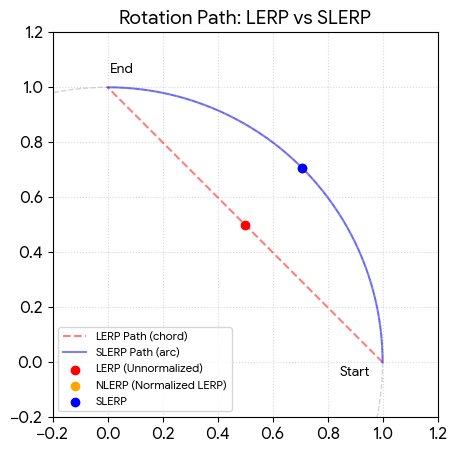

# Quaternions

In `3D space`, we usually think in degrees (Euler angles: X, Y, Z). However, using simple angles leads to Gimbal Lock, where two axes align and you lose a degree of freedom.

Quaternions represent rotations as a 4D vector $[x,y,z,w]$. While they aren't "human-readable," they offer:

- **Smooth Interpolation:** Perfect for animations (SLERP).
- **Efficiency:** Easier to combine and normalize than large matrices.
- **Stability:** No gimbal lock.


### quat.setAxes()

The `quat.setAxes` method in `glMatrix` is a powerful utility for when you know where you want an object to face, but you don't know the specific angles or rotation axis to get it there.

Essentially, it constructs a quaternion from a viewing coordinate system (Local X, Y, and Z axes).

**How it Works: The "Look At" Logic**

In 3D space, a rotation can be defined by three perpendicular vectors. `setAxes` takes these vectors and "packs" them into a quaternion.


It is the quaternion equivalent of building a **Rotation Matrix** from scratch using orthonormal basis vectors. This is particularly useful for:

- **Cameras:** Orienting a camera to look at a specific point.
- **Character AI:** Making an NPC turn to face the player.
- **Procedural Animation:** Aligning an object (like a laser bolt) to its velocity vector.


**Example:** [link](https://jsfiddle.net/softtiny/y5medv8o/)

```js
import {glMatrix,vec3, quat} from 'https://cdn.jsdelivr.net/npm/gl-matrix@3.4.4/+esm'
let posA=vec3.fromValues(1,2,3);
let posB=vec3.fromValues(4,5,6)
let outQuat = quat.create();
let view = vec3.create();
let right = vec3.create();
let up = [0, 1, 0]; // World Up
// 1. Calculate the 'view' (direction from A to B)
console.log(posA.toString());//"1,2,3"
console.log(posB.toString());//"4,5,6"
vec3.subtract(view, posB, posA);
console.log(view.toString());//"3,3,3"
vec3.normalize(view, view);
console.log(view.toString());//"0.5773502588272095,0.5773502588272095,0.5773502588272095"
// 2. Calculate the 'right' vector (cross product of up and view)
vec3.cross(right, up, view);
console.log(right.toString());//"0.5773502588272095,0,-0.5773502588272095"
vec3.normalize(right, right);
console.log(right.toString());//"0.7071067690849304,0,-0.7071067690849304"

// 3. Set the axes
console.log(outQuat.toString());//"0,0,0,1"
quat.setAxes(outQuat, view, up, right);
console.log(outQuat.toString());//"0.6576622724533081,0.7117631435394287,-0.24072110652923584,0.05410083383321762"
```

### quat.lerp(out, a, b, t) -> `{quat}`

In the glMatrix library, `quat.lerp` stands for Linear Interpolation. It is the faster, "dirty" sibling of slerp. While `slerp` moves along the curve of a sphere, `lerp` moves in a straight line between two points in 4D space.

The "Straight Line" Problem

When you use `lerp` on two quaternions, the math simply calculates a point on a straight line between them. Because quaternions must have a length (magnitude) of 1.0 to be valid rotations, a `lerp` causes a problem: the midpoint of that straight line is closer to the center of the sphere than the surface.

Results of using `lerp`:

- **Invalid Magnitude:** The resulting quaternion is no longer "normalized" (its length is less than 1).
- **Variable Velocity:** The rotation appears to speed up in the middle and slow down at the ends.
- **Non-Spherical:** It cuts "through" the sphere rather than sliding around it.

Slerp vs. Lerp (nlerp) Comparison


| **Feature**  | **quat.slerp**           | **quat.lerp (+ normalize)**            |
|--------------|--------------------------|----------------------------------------|
| **Path**     | Perfect arc              | Straight line (then pushed to arc)     |
| **Velocity** | Perfectly constant       | Slightly faster in the middle          |
| **CPU Cost** | High (Trig functions)    | Very Low (Basic math)                  |
| **Best Use** | Camera arcs, slow orbits | Thousands of particles, bone animation |


**Example:** [link](https://jsfiddle.net/softtiny/kpcob5w4/)

```js
import {glMatrix,mat2, mat2d, quat} from 'https://cdn.jsdelivr.net/npm/gl-matrix@3.4.4/+esm'

// 1. Create two quaternions (rotations)
const quatA = quat.create(); // Identity (no rotation)
const quatB = quat.create();

// Rotate quatB 90 degrees (PI/2) around the Y axis
quat.fromEuler(quatB, 0, 90, 0);

// 2. Create a placeholder for the result
const resultQuat = quat.create();
console.log(resultQuat.toString()) //"0,0,0,1"
console.log(quatB.toString()) //"0,0.7071067690849304,0,0.7071067690849304"
console.log(quatA.toString()) //"0,0,0,1"

// 3. Interpolate halfway (t = 0.5)
quat.lerp(resultQuat, quatA, quatB, 0.5);
console.log("Halfway Rotation:", resultQuat.toString()); //"0,0.3535533845424652,0,0.8535534143447876"
```



### quat.slerp(out, a, b, t) -> `{quat}`

In the world of 3D animation,  `quat.slerp` (Spherical Linear Interpolation) is the gold standard for rotating objects. While a standard linear interpolation (`lerp`) moves in a straight line between two points, `slerp` moves along the arc of a sphere.

| Parameter | Type   | Description                                                                    |
|-----------|--------|--------------------------------------------------------------------------------|
| out       | quat   | The receiving quaternion.                                                      |
| a         | quat   | The starting rotation.                                                         |
| b         | quat   | The ending rotation.                                                           |
| t         | number | The interpolation amount, typically between **0.0** (Start) and **1.0** (End). |


### quat.sqlerp()

While `slerp` (Spherical Linear Interpolation) is the go-to for moving between two rotations, `quat.sqlerp` (Spherical Quadrangle Interpolation) is the specialized tool for smooth paths through multiple rotations.

`sqlerp` uses "control points" to create a smooth, curved path—essentially a Bézier curve for rotations.


Parameter,Type,Description
out,quat,The receiving quaternion.
"a, b, c, d",quat,The four quaternions defining the curve.
t,number,The interpolation amount (0.0 to 1.0) between b and c.

**quat.sqlerp(out, a, b, c, d, t);**

| **Parameter** | **Type** | **Description**                                        |
|---------------|----------|--------------------------------------------------------|
| out           | quat     | The receiving quaternion.                              |
| a, b, c, d    | quat     | The four quaternions defining the curve.               |
| t             | number   | The interpolation amount (0.0 to 1.0) between b and c. |


**Mathematical Definition**

```math
sqlerp(a,b,c,d,t)=slerp(slerp(a,d,t),slerp(b,c,t),2t(1−t))
```