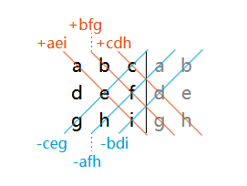

The **determinant** of a matrix is a special scalar value computed only from **square matrices** (same number of rows and columns). It is usually denoted as **det(A)**, **det A**, or **|A|**.

It tells us important things in linear algebra, such as:
- Whether the matrix is invertible (det ≠ 0 → invertible)
- How much a linear transformation stretches or shrinks areas/volumes (the scaling factor of signed volume)
- Whether a system of linear equations has a unique solution

### Quick Formulas by Size

**1×1 matrix**  
A = [a]  
**det(A) = a**

**2×2 matrix**  
$A = \begin{pmatrix} a & b \\ c & d \end{pmatrix} $
**det(A) = ad − bc**  
(mnemonic: main diagonal product minus anti-diagonal product)

**Example**  
$\begin{pmatrix} 3 & 1 \\ 5 & 2 \end{pmatrix} → det = (3·2) − (1·5) = 6 − 5 = $ **1**

**3×3 matrix** (most common hand calculation size)  
$A = \begin{pmatrix} a & b & c \\ d & e & f \\ g & h & i \end{pmatrix}$

Two popular ways to remember/compute it:

1. **Classic "cross products" method** (Sarrus' rule – good for memory)  
   Write the first two columns again to the right:  
   

   Positive diagonals (down-right): aei + bfg + cdh  
   Negative diagonals (up-right): ceg + bdi + afh  

   **det = (aei + bfg + cdh) − (ceg + bdi + afh)**

2. **Cofactor expansion** along row 1 (most systematic):  
   det(A) = a·C₁₁ + b·C₁₂ + c·C₁₃  
   where Cᵢⱼ = (−1)^(i+j) · det(minor of element i,j)

   For row 1 it becomes:  
   **det = a(ei − fh) − b(di − fg) + c(dh − eg)**

**Example**  
$\begin{pmatrix} 2 & 0 & 1 \\ 1 & 3 & 4 \\ 5 & 2 & 1 \end{pmatrix}$

Using expansion along row 1:  
$= 2·det\begin{pmatrix} 3 & 4 \\ 2 & 1 \end{pmatrix} − 0·det(...) + 1·det\begin{pmatrix} 1 & 3 \\ 5 & 2 \end{pmatrix}  
= 2·(3·1 − 4·2) + 1·(1·2 − 3·5)  
= 2·(3 − 8) + (2 − 15)  
= 2·(−5) − 13 = −10 − 13 =$ **−23**

### For larger matrices (4×4 and above)

Cofactor expansion becomes very tedious (lots of recursive 3×3 determinants). Better practical methods include:

- **Row reduction** (Gaussian elimination) to upper triangular form → det = product of diagonal entries (accounting for sign changes from row swaps)
- **LU decomposition** (when no pivoting needed): det(A) = det(L) · det(U) = 1 · product of U's diagonal
- Software / calculators (very common in practice)

### Quick Summary Table

| Matrix size | Easiest method                  | Formula / Rule                          |
|-------------|----------------------------------|------------------------------------------|
| 1×1         | Just the number                 | det = a                                 |
| 2×2         | Direct formula                  | ad − bc                                 |
| 3×3         | Sarrus or cofactor expansion    | a(ei−fh) − b(di−fg) + c(dh−eg)         |
| n×n         | Row reduction or software       | Product of pivots (with sign)           |

