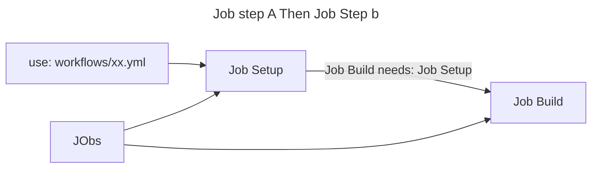
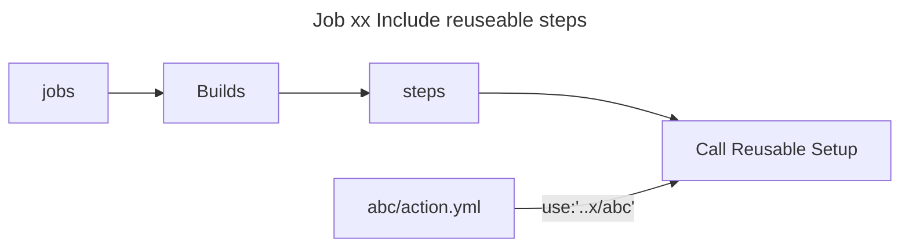

# Suggested Tree Structure for GitHub Actions Workflows

```tree
.github/
  workflows/
    ├── ci/                    # Continuous Integration workflows
    │   ├── build.yml         # Build-related jobs
    │   ├── test.yml          # Test-related jobs
    │   ├── lint.yml          # Linting jobs
    │   └── integration.yml   # Integration tests
    ├── cd/                    # Continuous Deployment workflows
    │   ├── deploy-dev.yml    # Deploy to development environment
    │   ├── deploy-staging.yml # Deploy to staging environment
    │   └── deploy-prod.yml   # Deploy to production
    ├── utils/                 # Reusable workflows or utility jobs
    │   ├── setup.yml         # Common setup steps (e.g., install dependencies)
    │   └── notify.yml        # Notification jobs (e.g., Slack, email)
    ├── schedules/             # Scheduled workflows
    │   ├── nightly-tests.yml # Nightly test runs
    │   └── cleanup.yml       # Cleanup jobs
    └── main.yml              # Optional: Main workflow to orchestrate others
```

- Key Considerations
    - Separation by Purpose:
        - Group workflows by their purpose (e.g., CI, CD, utilities, schedules).
        - ach YAML file should handle a specific task or set of related jobs (e.g., build.yml for building, test.yml for testing).
    - Reusable Workflows:
        - Use reusable workflows to avoid duplicating code. For example, create a setup.yml in utils/ that other workflows can call using the workflow_call trigger.

#### Example,Call it in another workflow.


```yaml
# .github/workflows/utils/setup.yml
name: Setup Environment
on:
  workflow_call:
jobs:
  setup:
    runs-on: ubuntu-latest
    steps:
      - uses: actions/checkout@v4
      - name: Install Dependencies
        run: npm install
```
```yaml
# .github/workflows/ci/build.yml
name: Build
on:
  push:
    branches: [main]
jobs:
  setup:
    uses: ./.github/workflows/utils/setup.yml
  build:
    needs: setup
    runs-on: ubuntu-latest
    steps:
      - run: npm run build
```



## Include steps


```yaml 
# ../abcd/action.yml
name: Setup Environment
description: 'pnpm'
runs:
  using: "composite"
  steps:
    - uses: actions/checkout@v4
    - uses: pnpm/action-setup@v4
      with:
        version: latest
```

```yaml
#.github/workflows/xx.yml
name: Debug demo view development
on:
  workflow_dispatch:
jobs:
  debug:
    runs-on: ubuntu-latest
    steps:
      - uses: actions/checkout@v4
      - name: Call Reusable Setup
        uses: ./.github/abcd
```


