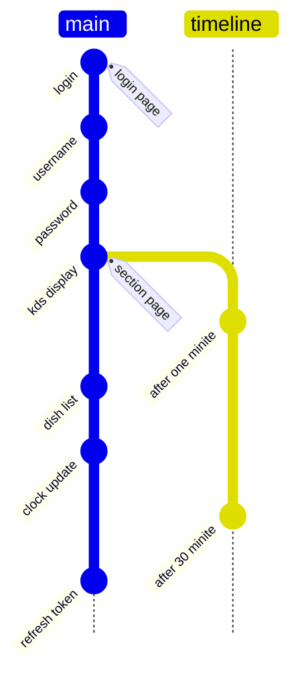
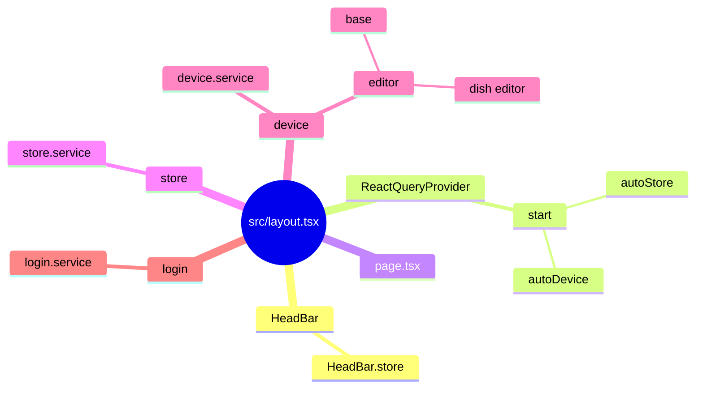
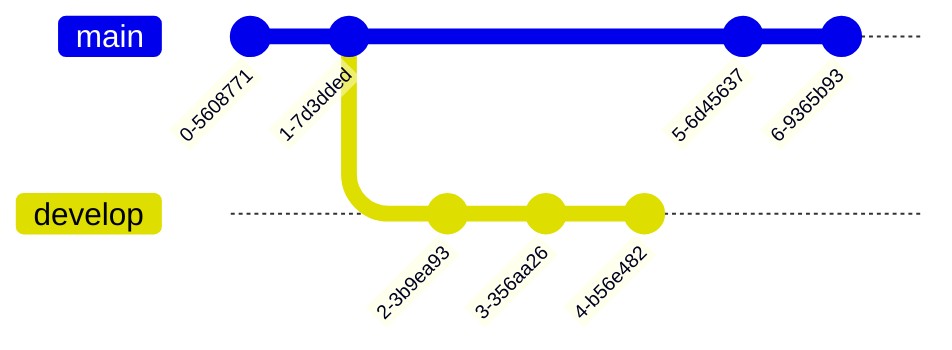
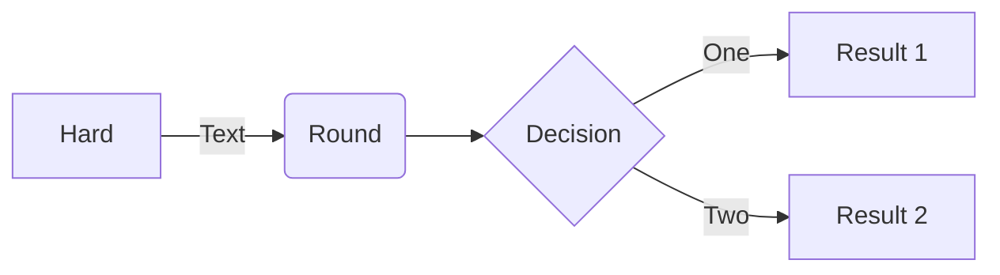
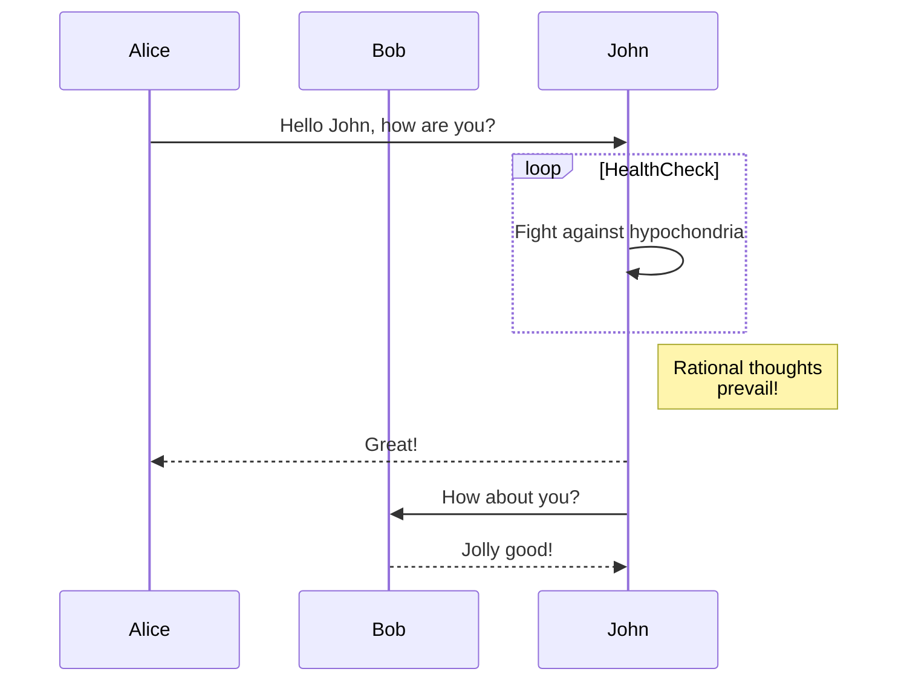

## Application

### Kitchen Display Systems (KDS)

- [ ] set interval time refresh user token and log out status
- [ ] order timer clock
- [ ] ADS
- [ ] Pagination
- [ ] dishs display
- [x] pages login,store,device ui.
- [ ] page history, config
- [ ] Parse CSS and add vendor prefixes to rules by Can I Use 
- [ ] from enter to display
- [x] 401 log out
- [ ] weight dish show
- [ ] dish or pick code or table no search

