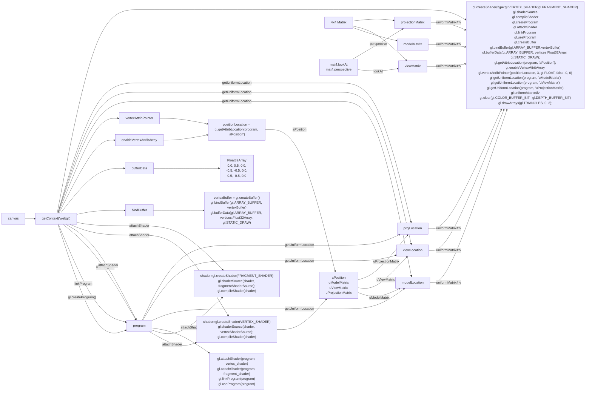

# [glmatrix](https://github.com/toji/gl-matrix)

## Javascript Matrix and Vector library for High Performance WebGL apps 

- Modules
  - glMatrix
  - mat2 (2x2 Matrix)
  - mat2d ( a short form for the 3x3 matrix)
  - mat3 (3x3 Matrix)
  - mat4 (4x4 Matrix)
  - quat
  - quat2
  - vec2 (2 Dimensional Vector)
  - vec3 (3 Dimensional Vector)
  - vec4 (4 Dimensional Vector)

## Codes

