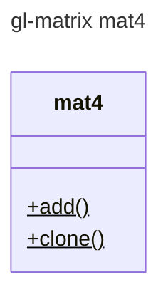

# Module: mat4



#### 4x4 Matrix


## Adjugate matrix
todo
- [ ] Minor 
- [ ] cofactor 
- [ ] Determinant 
```math
 \det{(A)} = |A| =
 \begin{vmatrix}
 a & b \\
 c & d
 \end{vmatrix}
  =ad - cb

```
- [ ] inverse of a matrix

```math
A = 
\begin{Bmatrix}
a & b \\
c & d
\end{Bmatrix} \\
 A* = 
 \begin{Bmatrix}
d & -b \\
-c & a
\end{Bmatrix}
```

**The Cauchy-Schwarz Inequality**
```math
\left( \sum_{k=1}^n a_k b_k \right)^2 \leq \left( \sum_{k=1}^n a_k^2 \right) \left( \sum_{k=1}^n b_k^2 \right)
```

## Determinant
todo