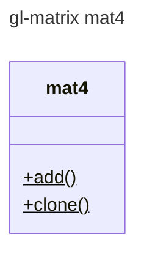

# Module: mat4



#### 4x4 Matrix


## Adjugate matrix
todo
- [ ] Minor 
- [ ] cofactor 
- [ ] Determinant 
```math
 \det{(A)} = |A| =
 \begin{vmatrix}
 a & b \\
 c & d
 \end{vmatrix}
  =ad - cb

```
- [ ] inverse of a matrix

```math
A = 
\begin{Bmatrix}
a & b \\
c & d
\end{Bmatrix} \\
 A* = 
 \begin{Bmatrix}
d & -b \\
-c & a
\end{Bmatrix}
```

**The Cauchy-Schwarz Inequality**
```math
\left( \sum_{k=1}^n a_k b_k \right)^2 \leq \left( \sum_{k=1}^n a_k^2 \right) \left( \sum_{k=1}^n b_k^2 \right)
```

## Determinant
todo

## The Frobenius norm, sometimes also called the Euclidean norm 
- Matrix Norm
  - norms


## Quaternion 

```math
 
  \mathbf{i}^2 = \mathbf{j}^2 = \mathbf{k}^2 = \mathbf{i}\mathbf{j}\mathbf{k} = -1\\
  a + b\mathbf{i} + c\mathbf{j} + d\mathbf{k} \\
  \mathbf{i}\mathbf{j} = \mathbf{k}, \mathbf{j}\mathbf{i} = -\mathbf{k}\\
  \mathbf{j}\mathbf{k} = \mathbf{i}, \mathbf{k}\mathbf{j} = -\mathbf{i}\\
  \mathbf{k}\mathbf{i} = \mathbf{j}, \mathbf{i}\mathbf{k} = -\mathbf{j}\\
```


## conjugate
- the two solutions of a quadratic equation are conjugate
- quadratic equation
```math
a\mathbf{x}^2 + b\mathbf{x} + c = 0\\
```
```math
\mathbf{x} = \frac{-b\pm\sqrt{b^2-4ac}}{4}
```